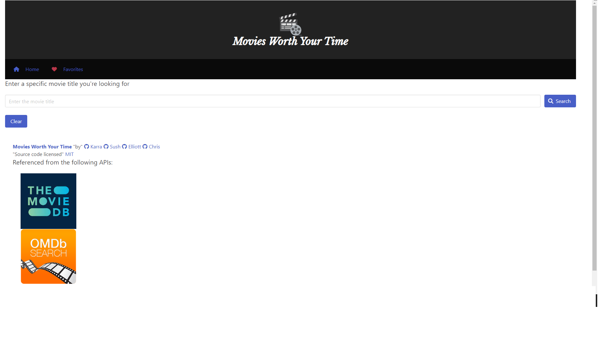

# Movies-worth-your-time
The user has the ability to search movies and view congregated scores and can save what they want to watch into a list that is saved for them to view at a later time.

## Technologies Used:
OMDB api: https://www.omdbapi.com/
TMDB api: https://developer.themoviedb.org/reference/intro/getting-started

## Screenshot

## Deploment link: 

https://sush-tech.github.io/Movies-worth-your-time/
